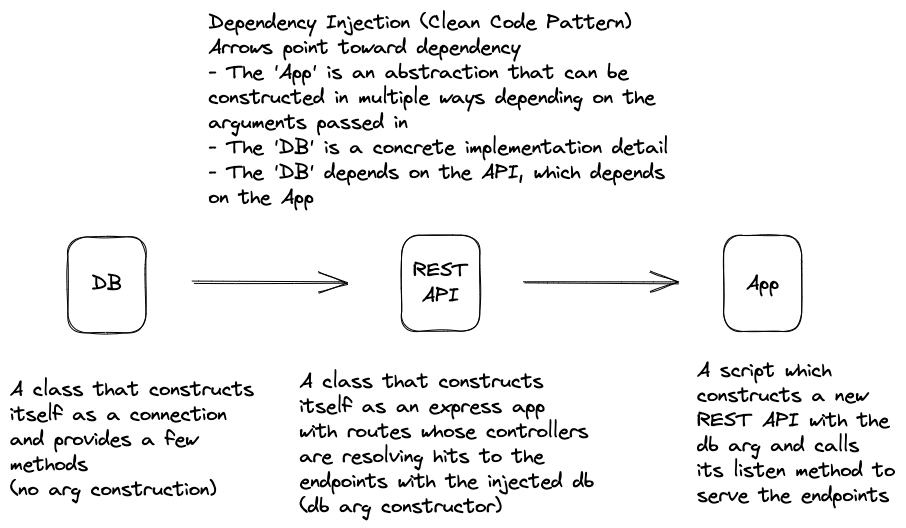

# deno-dependency-injection



-make sure latest version of deno is installed
(deno 1.29.1) with npm: compatibility

```shell
deno run src/server.ts --allow-all
```

- answer 'y' to all prompts

```shell
curl localhost:8080/

curl -X POST -H "Content-Type: application/json" \
 -d '{"name":"abc","age": 123}' \
 localhost:8080/users
```

#### Architecture Notes

- the DI is based on classes, but it could work
  with functions just as well. In fact, the
  appFunction file in the archive folder is a
  drop-in replacement for the app.js file in src
  folder.
